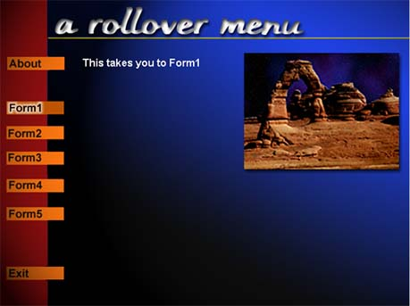



## Multimedia Rollover Menu

### Description

This code shows how to create a multimedia type rollover menu that changes text and graphics on the form. This uses a rect function to recognize the rollover hotspots. (A MUST SEE)
 
### More Info
 
You will have to replace the MsgBox statement with navigation on the frmMenu.

             |
---                |---
**Submitted On**   |2000-04-17 23:49:00
**By**             |[AlexHogan](https://github.com/Planet-Source-Code/PSCIndex/blob/master/ByAuthor/alexhogan.md)
**Level**          |Intermediate
**User Rating**    |5.0 (50 globes from 10 users)
**Compatibility**  |VB 5\.0, VB 6\.0
**Category**       |[Custom Controls/ Forms/  Menus](https://github.com/Planet-Source-Code/PSCIndex/blob/master/ByCategory/custom-controls-forms-menus__1-4.md)
**World**          |[Visual Basic](https://github.com/Planet-Source-Code/PSCIndex/blob/master/ByWorld/visual-basic.md)
**Archive File**   |[CODE\_UPLOAD49094182000\.zip](https://github.com/Planet-Source-Code/alexhogan-multimedia-rollover-menu__1-7359/archive/master.zip)

